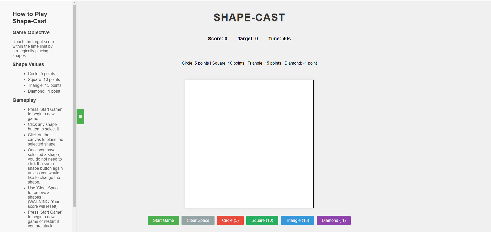

# Shape-Cast

## Description
This is my project submission for the AWS Game Builder Challenge (https://awsdevchallenge.devpost.com/). \
As the competition has ended, I have shut down the App Deployment. \
If you would like to view my submission, please drop me a request on Linkedin.

## Purpose For The Developer
Provided an opportunity for me to explore and familiarize myself with AWS technologies and have fun making a game.

## Intended Purpose Of The Game
Shape-Cast is an interactive game where players strategically select and place different shapes on a blank canvas to achieve the target score within a time limit.
The game combines quick thinking with score optimization and seeks to challenge players to use various shapes (each with different points) to reach the goal.

## Technical Implementation
This project was developed using:
- HTML for game rendering
- Vanilla JavaScript for game logic
- CSS for styling and responsive design
- Amazon Q Developer for game development
- AWS Amplify for web hosting

### How I Used Amazon Q Developer 
Amazon Q Developer was instrumental in the development process:
- Code Generation: Used to generate the initial HTML structure and canvas for the game
- Best Practices: Provided guidance on implementing game features and overall structure
- Good SWE Principles: Ensured that poor code practices were avoided as much as possible (i.e. depth of arrowhead code, nested loops, poor code commit language)
- Code Review: Utilized the inbuilt '/review' to identify and fix potential issues in the implementation
- Code Organization: Utilized the assistant to seek guidance on how to organize codebase (especially script.js)

### How I Used Other AWS Services
- I used AWS Amplify to deploy the game as a web application: https://main.d1tlgag3vgp7ls.amplifyapp.com/ 

## Features
- Real-time score tracking and countdown
- Multiple shape options with different point values:
    - Circle (5 points)
    - Square (10 points)
    - Triangle (15 points)
    - Diamond (-1 point)
- 40-second time limit per round
- Interactive canvas-based gameplay
- Clear space functionality
- Collapsible in-game guide displayed in a left sidebar

Below is a screenshot of the game screen:

## Functionalities
- Timer implementation
- Canvas rendering and the ability to place different shapes
- Score calculation logic in real-time
- DOM manipulation for the sidebar to display in-game guide
- Shape selection mechanism
- Persistent shape selection (allowing user to continuously place a shape until user decides to change it)

## Game Rules (Also Available In-Game)
1. Game Objective: Reach the target score within the time limit by strategically placing shapes.

2. Shape Values:
   Circle: 5 points
   Square: 10 points
   Triangle: 15 points
   Diamond: -1 point

3. Gameplay:
   - Press 'Start Game' to begin a new game 
   - Click any shape button to select it</li>
   - Click on the canvas to place the selected shape</li>
   - Once you have selected a shape, you do not need to click the same shape button again unless you would like to change the shape.</li>
   - In other words, you can select a shape once and place it on the canvas as many times as you can and as fast as you can until you need to change the shape.</li>
   - Use 'Clear Space' to remove all shapes (WARNING: Your score will reset!)</li>
   - Press 'Start Game' to begin a new game or restart if you are stuck</li>

4. Tips
   - Plan your shape placements carefully
   - Watch the timer
   - Use diamonds strategically to adjust your score</li>

## License
MIT
